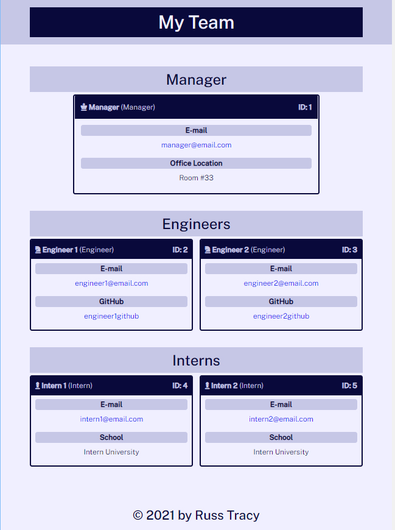

# Team Profile Generator
    
This is a Node.js application that will generate a team profile page based on user input for companies with teams of employees.

# Installation

Clone the repositry from GitHub and open using Visual Studio Code.

# Usage 
[Demo Viedo](https://drive.google.com/file/d/1xA6N26Q5aexqq9W16pUl6gKMe6Degp7E/view?usp=sharing)

# Credits

Made by [Russ Tracy]

[NPM inquirer.js](https://www.npmjs.com/package/inquirer)

[Jest](https://jestjs.io/)

# Questions

[Contact Me](russ_tracy@comcast.net)

[GitHub](https://github.com/russtracy)
